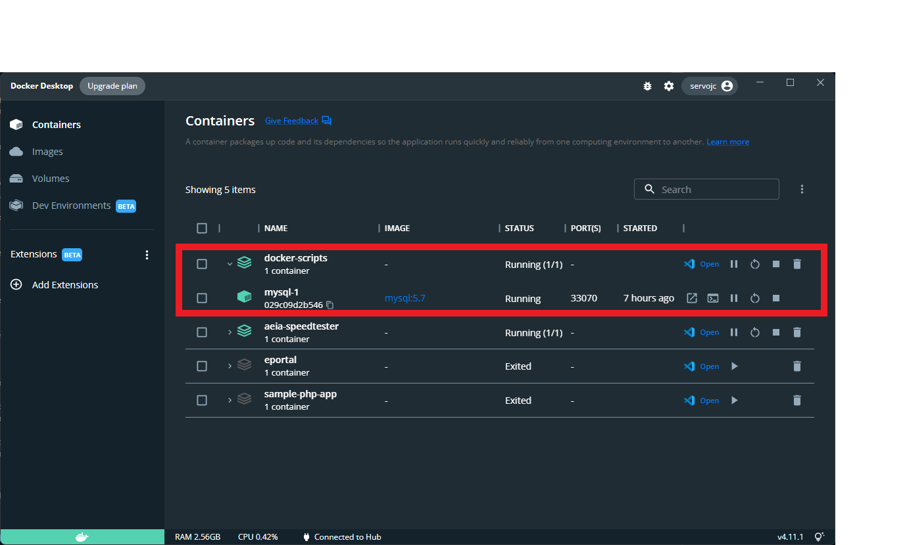

# docker-database-compose
POC for setting up various database in docker.

## Overview
To support multiple instances of database (currently supported: MySQL) in a local machine.
This can be used in development, demo and testing scenarios without reimporting new database.

## Installation
Before installing docker, make sure you enable the [Windows Subsystem for Linux](https://pureinfotech.com/install-windows-subsystem-linux-2-windows-10/) if you are using windows.
To install docker, visit this [link](https://www.docker.com/products/docker-desktop/).


## Configuring
Create a folder for each database instance and paste the yaml file inside the folder.
Configure the docker-compose file in your liking.

You may change the desired image/version of the database and the environment variables such as:

1. MYSQL_USER
2. MYSQL_PASSWORD
3. MYSQL_ROOT_PASSWORD

and the port of the database instance:

```
 # <Port exposed (you can change this to have multiple instance)> : < MySQL Port running inside container>
 '3306:3306'
```

You can also set the sql_mode of the database by editing the command

```
mysqld --sql_mode=""
```

## Running
Open the folder directory in a terminal (Powershell or Bash) and run this docker command to create the containers.
```
# Start container with logs on terminal
docker-compose up

# Start container with no logs on terminal
docker-compose up -d
```

## Result
You can now check the running container by running this command:

```bash
$ docker ps
```

Or by viewing the Docker Desktop


